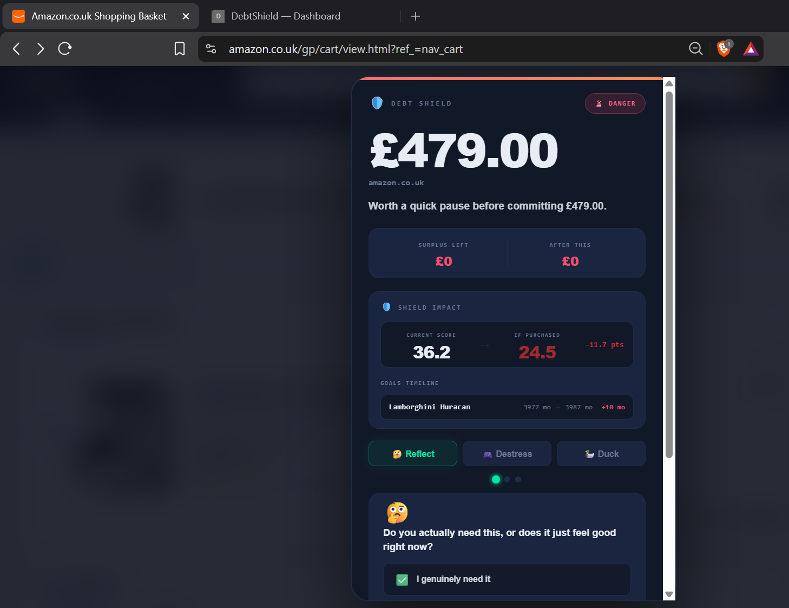
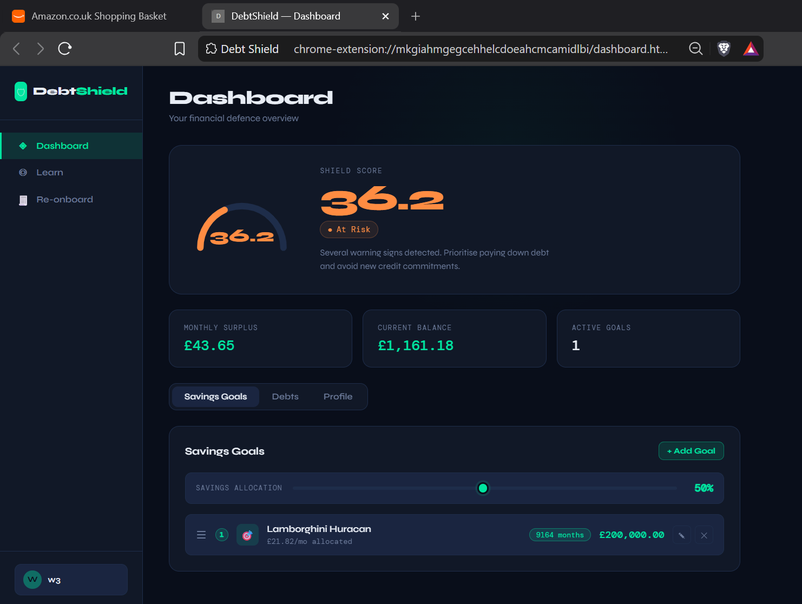

# 🛡️ DebtShield V2



My team ([Shubh](https://github.com/ShubhdeepK), [Jamie](https://github.com/JamieGuo7) and [Daiki](https://github.com/daiki078)) and I built DebtShield for the 2026 Warwick Finance Societies Fintech Hackathon, a great time from start to finish despite the intensity! At its core it's a Monte Carlo credit-risk scoring engine, targeted at the Financial Inclusion category, which we interpreted as ordinary struggling people. We won not only the 'Best Financial Inclusion Hack' prize, but also the 'Best Overall Hack', bringing a huge £1500 for me and my team to split (£500 for the financial inclusion prize and £1000 for the overall prize).

We noted that impulsive spending is getting more and more common due to the frictionless nature of online checkout procedures, accelerated by potentially dangerous BNPL schemes (customer dependent). So we decided to add a bit more friction back into this process via a Chrome extension by showing how each purchase will negatively impact a person's finances and the magnitude of this.

We initially assign a score to a user's bank statement based on spending and income history. The score is derived via the likelihood of default determined via the Monte Carlo simulator. This alone gives the user a good idea of how their finances are looking. At checkout our extension intervenes, making the user aware of the impact of this purchase by simulating a new Shield Score with this purchase taken into account and highlighting the difference in the score.



This repo holds my solo rebuild of DebtShield, built to a production-grade standard rather than a hackathon prototype. Some highlights of the edits: I found and fixed a variance bug that let one test profile's implied income volatility spike to 412% unflagged, dragging a near-riskless profile's score down to 67.7 - now caught by an explicit coefficient-of-variation check, derived from a stated tail-tolerance assumption rather than guessed. The single-bad-month default trigger became a Basel II-aligned three-consecutive-month rule, and the linear score that undersold mid-range risk became a log-odds transform in the same family that real credit scorecards (like Experian) use. Every Monte Carlo estimate ships with a proper 95% confidence interval, correctly adjusted for the antithetic-pairing variance reduction technique I used to compute it, and the whole engine is checked via a sensitivity analysis and a convergence study.

See `FEATURES.md` for the full list of what changed and the math and derivations behind it.

## Test data

`data/` holds three example transaction sets, sourced via the Open Banking Project sandbox and cleaned into CSV files. Account 1 is distressed, with payday loans, subprime credit, and frequent negative balances. Account 2 stays healthy, with stable income and balance never negative. Account 3 sits in between, with modest income and risk from expense timing rather than debt. In a final commercial version, we would attempt to connect with Open Banking but due to restrictions on obtaining it we use the CSVs for development and testing. `BASELINE.md` holds the reference scores for the three CSVs. Everything else in `data/` is generated rather than input: the convergence and sensitivity study outputs, the plot drawn from them, and the screenshots used here.

## Onboarding debts

A note on onboarding: declared debts must already appear in the uploaded statement. The backend subtracts each declared monthly payment from average expenses before simulating, then charges the debt on its own schedule with interest and payoff, so each payment is counted exactly once. Declaring a debt the statement never saw subtracts it from expenses it was never part of, and the score comes out too optimistic by that payment. The reverse holds too. An undeclared debt stays inside expenses as a flat monthly outflow, skipping the simulator's amortisation schedule. Its interest never accrues and its balance never drops. It is therefore up to the user to input this accurately.

## Setup

Python backend on FastAPI, with the simulator itself written as fully vectorised NumPy - no Python loop over paths, just one over the 12 months.

```bash
cd debt-shield-extension
python -m venv .venv

# Windows
.venv\Scripts\activate

# macOS/Linux
source .venv/bin/activate

pip install -r requirements.txt
uvicorn main:app --reload
```

Backend runs at `http://127.0.0.1:8000`. Then load `debt-shield-extension/` as an unpacked extension in Chrome (`chrome://extensions` → Developer mode → Load unpacked).

**Note:** regenerating `requirements.txt` from PowerShell with `>` writes UTF-16 and breaks pip. Use `pip freeze | Out-File -Encoding utf8 requirements.txt`, or run it from cmd.

## Example

An example API request to the backend, and the response it returns. You need to onboard a user through the extension first, uploading one of the CSVs in `data/` - onboarded user data is gitignored, so a fresh clone starts with none. `w3` here is the name I gave Account 3:

```bash
curl http://127.0.0.1:8000/score/w3
```
```json
{"name":"w3","shield_score":36.2,"shield_score_ci_low":36.0,"shield_score_ci_high":36.3,"variance_clamped":false}
```